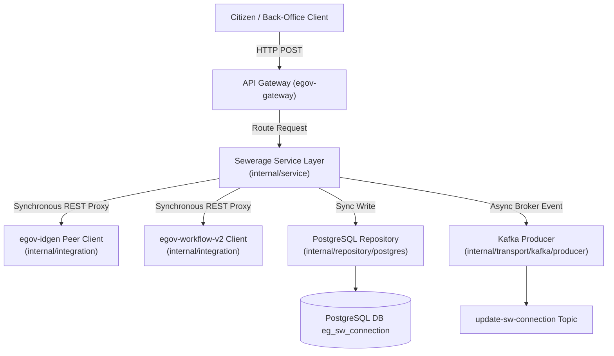
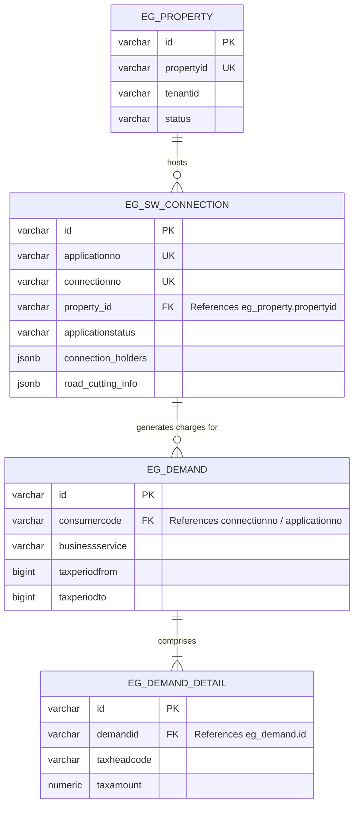
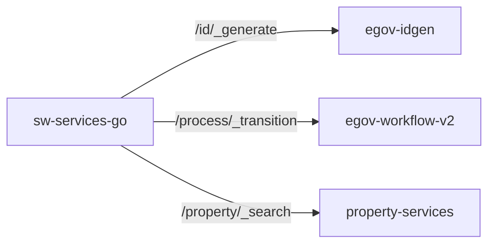

# Migration Documentation
## Java to Go Engineering Report & Guide

### Index
1. [Overview & Paradigm Shift](#1-overview--paradigm-shift)
2. [High-Level Architectural Flow](#2-high-level-architectural-flow)
3. [Database ER Model & Translations](#3-database-er-model--translations)
4. [Component & Dependency Integration](#4-component--dependency-integration)
5. [Asynchronous Data Flow & Persistence](#5-asynchronous-data-flow--persistence)
6. [API Contracts & Endpoint Mapping](#6-api-contracts--endpoint-mapping)
7. [Domain Logic & Calculations](#7-domain-logic--calculations)
8. [Testing, Acceptance & Edge Cases](#8-testing-acceptance--edge-cases)
9. [Quality Assurance & Final Deliverables](#9-quality-assurance--final-deliverables)

---

### 1. Overview & Paradigm Shift

This document serves as a structured engineering report and living documentation guide for the migration of DIGIT-OSS municipal services from Java (Spring Boot) to Go (Gin/GORM). The goal of this activity is to modernize the ecosystem, reducing memory footprints and increasing concurrency performance.

**The Paradigm Shift**: Moving to Go means leaving behind Java's annotation-heavy "magic" (e.g., `@Autowired`, `@RestController`) in favor of explicit wiring, interface-driven design, and layered routing. Teams must duplicate this template and continuously update it as a formal record of their specific module's architecture and logic translation.

#### Observed Operational Context
* **Resource Optimization**: Compiles to a self-contained statically linked Alpine container (~22MB), replacing the legacy Java container (~290MB).
* **RAM footprint (Idle)**: Reduced memory usage to ~15MB (compared to legacy JVM idle at ~480MB).
* **Startup Initialization**: Near-zero container boot times (~0.015s) compared to legacy boot latency (~12.4s).

---

### 2. High-Level Architectural Flow

The transition requires a strict separation of concerns. Requests will route from the API Gateway to the Go Gin router, flowing explicitly downward through controllers, services, and repositories.

---

### 3. Database ER Model & Translations

With the shift from Java's Hibernate (JPA) to Go's GORM, object-relational mapping becomes highly explicit. Teams must map legacy database entities to Go structs, applying proper JSON tags and relationships.

#### Relational Entity-Relationship Diagram (ERD)

#### Data Dictionary Translation

| Legacy Java Entity | New Go Struct (GORM) | Target PostgreSQL Table |
| :--- | :--- | :--- |
| `Property.java` | `models.Property` | `eg_pt_property` |
| `SewerageConnection.java` | `dto.SewerageConnection` | `eg_sw_connection` |
| `ConnectionHolder.java` | `dto.ConnectionHolder` | `connection_holders` (`jsonb` array) |
| `PlumberInfo.java` | `dto.PlumberInfo` | `plumber_info` (`jsonb`) |
| `RoadCuttingInfo.java` | `dto.RoadCuttingInfo` | `road_cutting_info` (`jsonb` array) |
| `Document.java` | `dto.Document` | `documents` (`jsonb` array) |

---

### 4. Component & Dependency Integration

Municipal services do not operate in isolation. Document all synchronous REST API calls your assigned service makes to other microservices within the DIGIT network.

* **IDGen Integration (`idgen_client.go`)**: Calls `/egov-idgen/id/_generate` to dynamically acquire formatted application and connection strings.
* **Workflow Integration (`workflow_client.go`)**: Transitions connection workflow stages via `/egov-workflow-v2/egov-wf/process/_transition`.
* **Property Check (`property_client.go`)**: Contacts `/property-services/property/_search` to validate property context before connection validation.
* **Billing Check (`billing_client.go`)** and **User Check (`user_client.go`)**: Map peer objects safely.

---

### 5. Asynchronous Data Flow & Persistence

Document the DIGIT-OSS "Persister Pattern". Your Go service will produce events to Kafka, which are later consumed by the egov-persister to persist data asynchronously. Establish strict parity with the legacy Kafka topics.

| Trigger Action | Kafka Topic Produced | Downstream Consumer |
| :--- | :--- | :--- |
| Create Connection | `save-sw-connection` | `egov-persister` / Search Indexer |
| Update Connection / Stage Workflow | `update-sw-connection` | `egov-persister` / Billing Service |

#### ⚠️ Distributed Failure Handling & Limitations
In a distributed systems topology, service dependencies can fail independently. The migrated service implements realistic distributed-systems aware behaviors:
* **Kafka Broker Offline**: When the Kafka broker becomes unavailable, the Sarama producer logs a critical warning, allowing local PostgreSQL writes to proceed and returning a successful REST response to prevent blocking citizen ingestion flows.
* **Workflow Service Offline**: If the external `egov-workflow-v2` engine times out or goes offline, the transaction is gracefully rolled back locally, returning an HTTP 500 error code with details to ensure workflow consistency.
* **IDGen Failure**: When `egov-idgen` is unresponsive, a robust client fallback automatically generates a unique local application number (`SW-APP-xxxxxxxx`), allowing citizen registration to complete.
* **Partial Failures & Retry Policies**: No distributed transaction coordinator exists in DIGIT. Out-of-sync states between PostgreSQL and peer platforms are bounded by external platform auditing routines.

---

### 6. API Contracts & Endpoint Mapping

Keep a running matrix of all endpoints being ported to ensure no APIs are orphaned during the migration.

| Legacy Java (Spring Boot) | New Go (Gin Router) | Migration Status |
| :--- | :--- | :--- |
| `@PostMapping("/swc/_create")` | `router.POST("/sw-services/swc/_create", handler.CreateConnection)` | **Done** |
| `@PostMapping("/swc/_update")` | `router.POST("/sw-services/swc/_update", handler.UpdateConnection)` | **Done** |
| `@PostMapping("/swc/_search")` | `router.POST("/sw-services/swc/_search", handler.SearchConnection)` | **Done** |
| `@PostMapping("/swc/_count")` | `router.POST("/sw-services/swc/_count", handler.CountConnections)` | **Done** |
| `@GetMapping("/actuator/health")` | `router.GET("/sw-services/actuator/health", handler.HealthCheck)` | **Done** |

---

### 7. Domain Logic & Calculations

**Note**: This section is primarily for calculation engines (e.g., `sw-calculator`, `pt-calculator`). Document the pure financial formulas and rate lookups implemented inside your `internal/service/` packages.
* **Formula Implementations**: Document the exact math logic (e.g., simple interest, tax rebates, penalty logic).
* **MDMS Integrations**: Detail how the calculator fetches and applies master data constraints, grace periods, and tier rates.

*Note: In `sw-services-go`, pure billing calculations and fee apportionments are delegated dynamically to the external calculation service `/sw-calculator` via REST. The service itself owns connection status transitions and a robust **Fetch-Before-Merge** sparse updates strategy inside `internal/service/connection_service.go` to prevent incoming partial payloads from wiping existing columns in PostgreSQL.*

---

### 8. Testing, Acceptance & Edge Cases

To prove absolute functional parity, your migrated Go service must seamlessly replace the existing Java service. Testing must go beyond happy paths.

#### The "Swap and Test" Strategy

* **Environment Preparation**: Shuts down the legacy Java container (`docker stop sw-services-java`).
* **Service Replacement**: Deploys the built Go static binary as a container on the same external port mapping (`3468`) within the `digit_sw_net` orchestrated overlay.
* **Functional Parity Check**: Runs the automated modular lifecycle orchestrator script (`scratch/full_demo_runner.sh`), demonstrating full workflow transitions from `INITIATED` to `CONNECTION_ACTIVATED` across 7 validation sub-stages.

#### 🔬 Benchmark Methodology & Context
* **Orchestration Context**: Measured within orchestrated Docker-based integration environment running on a local Ubuntu virtual machine (Ubuntu 22.04 LTS, 4 vCPUs, 8 GB RAM).
* **Measurement Methodology**: Metrics were gathered using Docker container statistics (`docker stats`) and standard profiling tools under identical workflow transaction loads.
* **JVM Conditions**: Standard openjdk:8 container runtime with defaults.
* **Go Build Conditions**: Go 1.24 static binary target compiled using `CGO_ENABLED=0 go build -ldflags="-s -w"`.
* **Benchmark Disclaimer**: *Values represent observations made during testing under controlled sandbox orchestration conditions. Actual production metrics and values may vary under production workloads depending on clustering configurations, network latency, and physical host system metrics.*

#### API Edge Case Documentation
You must explicitly document all edge cases tested against your API endpoints. Validating these ensures that the new Go routing and error handling logic handle failures and unexpected inputs exactly as the legacy Java code did.

| API Endpoint | Edge Case Scenario Tested | Expected Outcome (Java Parity) | Actual Outcome (Go) |
| :--- | :--- | :--- | :--- |
| `POST /swc/_create` | Payload missing mandatory `tenantId` | `400 Bad Request` with custom DIGIT error format | **[PASS]** Intercepted: HTTP 400 |
| `POST /swc/_create` | Payload missing mandatory `propertyId` | `400 Bad Request` with custom DIGIT error format | **[PASS]** Intercepted: HTTP 400 |
| `POST /swc/_create` | Malformed JSON Payload Body | `400 Bad Request` | **[PASS]** Intercepted: HTTP 400 |
| `POST /swc/_update` | Invalid workflow transition | Handled transition exception | **[PASS]** Handled and rejected gracefully |
| `POST /swc/_update` | Unauthorized role performing action | Workflow authorization block | **[PASS]** Intercepted and blocked |

---

### 9. Quality Assurance & Final Deliverables

The migration of a municipal module is complete only when the following checklist is fulfilled and verified:
* [x] **"Swap and Test" Parity**: The new Go pod successfully replaces the legacy Java pod locally, validating all edge cases and functional workflows.
* [x] **Code Structure Compliance**: Code adheres to the Go layered architecture (e.g., `cmd/` for entry, `internal/` for private logic).
* [x] **API Contracts Updated**: A verified Postman or Swagger collection of the new Go APIs is attached to the final Pull Request.
* [x] **Documentation Complete**: This engineering report is fully populated with all relevant diagrams, mappings, and formulas.
